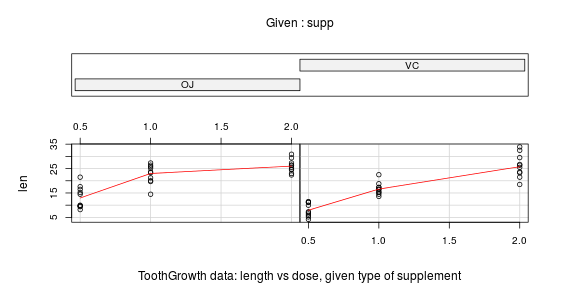

Tooth Growth
============

Load the ToothGrowth data and perform some basic exploratory data analyses 
Provide a basic summary of the data.
Use confidence intervals and/or hypothesis tests to compare tooth growth by supp and dose. (Only use the techniques from class, even if there's other approaches worth considering)
State your conclusions and the assumptions needed for your conclusions. 
Some criteria that you will be evaluated on
Did you  perform an exploratory data analysis of at least a single plot or table highlighting basic features of the data?
Did the student perform some relevant confidence intervals and/or tests?
Were the results of the tests and/or intervals interpreted in the context of the problem correctly? 
Did the student describe the assumptions needed for their conclusions?

# Main goal

```
Analyze the ToothGrowth dataset. Perform a basic inferential data analysis.
```

# Exploratory analysis

### Load the dataset


```r
data(ToothGrowth)
summary(ToothGrowth)
```

```
##       len       supp         dose     
##  Min.   : 4.2   OJ:30   Min.   :0.50  
##  1st Qu.:13.1   VC:30   1st Qu.:0.50  
##  Median :19.2           Median :1.00  
##  Mean   :18.8           Mean   :1.17  
##  3rd Qu.:25.3           3rd Qu.:2.00  
##  Max.   :33.9           Max.   :2.00
```

The dataset analyzes the effect of vitamin C on tooth growth in guinea pigs. 

```
[,1]  len   numeric  Tooth length                <- this variable depends on the other two variables 
[,2]  supp  factor   Supplement type (VC or OJ). <- independent variable
[,3]  dose  numeric  Dose in milligrams.         <- independent variable
```

### Plot the dataset, isolating the variables:

First, tooth length as a function of the supplement type. Then, tooth length as a function of the dose.


```r
par(mfrow=c(1,2))
boxplot(len ~ supp,
	    data = ToothGrowth,
	    xlab = "supplement type",
	    ylab = "tooth length",
	    main = "Tooth growth | supplement type")
boxplot(len ~ dose,
	    data = ToothGrowth,
	    xlab = "dose (in ml.)",
	    ylab = "tooth length",
	    main = "Tooth growth | dose")
```

 
